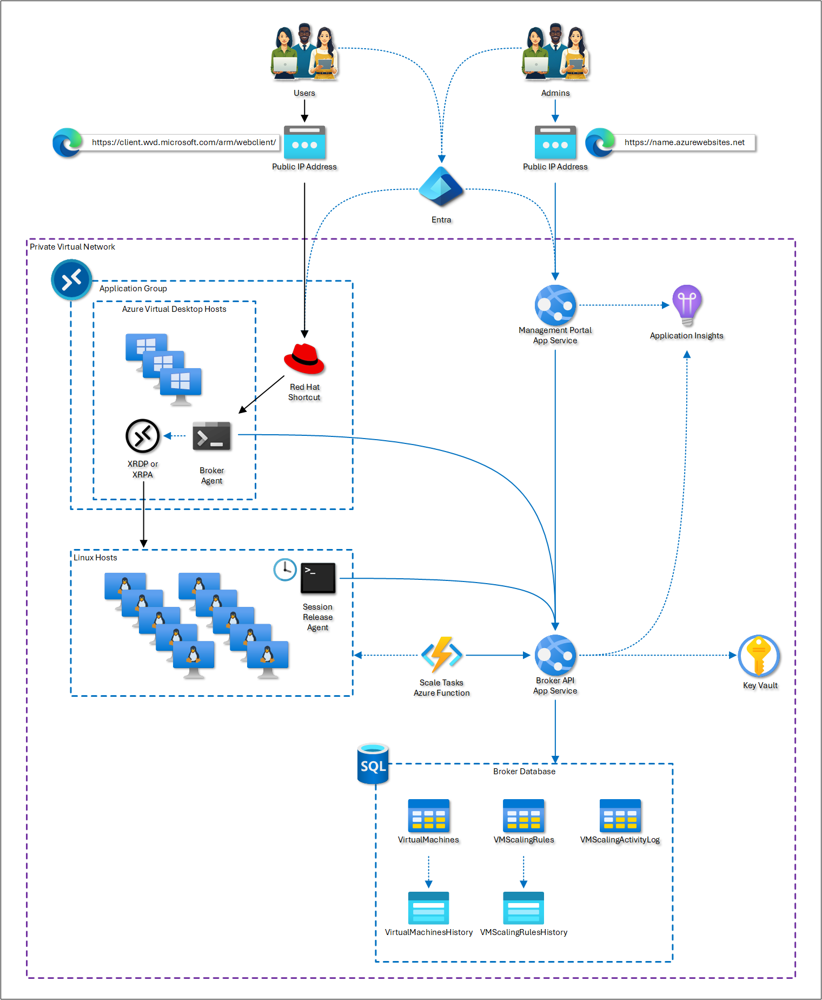
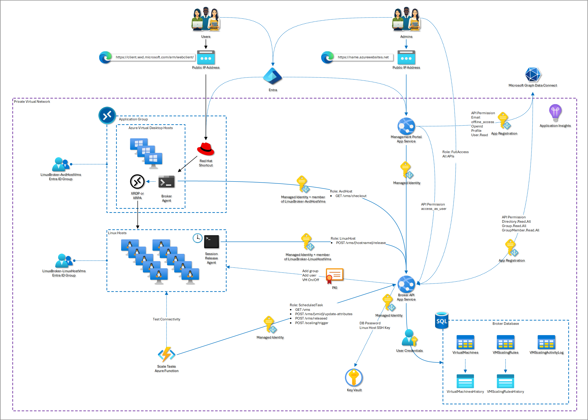

# Linux Broker for Azure Virtual Desktop (AVD) Access

## Purpose

The **Linux Broker for AVD Access** is a solution designed to manage and broker user access to Linux hosts via Azure Virtual Desktop (AVD). It provides a scalable and efficient way to connect users to Linux virtual machines (VMs) using either Remote Desktop Protocol (RDP) for full desktop experiences or XRPA (X Remote Application) for virtualized applications.

This solution leverages Azure services such as managed identities, security groups, Azure App Service, Azure Functions, and Azure SQL Database to provide secure and efficient brokering, session management, and scaling of Linux hosts.

## Architecture Description

The solution consists of the following components:

- **Azure Virtual Desktop (AVD)**: Provides the interface for users to access Linux hosts. Users can connect via the AVD web client or any supported AVD client.

- **Broker Agent (`Connect-LinuxBroker.ps1`)**: A PowerShell script running on each AVD host that acts as an agent to broker connections to Linux hosts. It connects to the Broker API using managed identity to check out a Linux VM and initiate the appropriate connection (RDP or XRPA).

- **Linux Hosts Cluster**: A set of Linux VMs that users connect to. Each Linux host has managed identity enabled and runs a Session Release Agent.

- **Session Release Agent**: A cron job running on each Linux host that checks for disconnected user sessions (both XRDP and XRPA) and initiates a 20-minute logoff process, releasing the VM for other users while allowing the disconnected user to reconnect within that time frame.

- **Broker API**: A RESTful API running on Azure App Service that handles interactions between the Broker Agent, Session Release Agent, and the Broker Database. It uses managed identities and Azure Key Vault for secure access to resources.

- **Broker Database**: An Azure SQL Database that stores information about virtual machines, scaling rules, and scaling activity. It includes the following tables:
  - `virtual_machines`: Stores information about Linux VMs, including hostname, IP address, power state, network status, VM status, connected username, AVD host, and VM ID.
  - `vm_scaling_rules`: Stores scaling rules for the Linux host cluster.
  - `vm_scaling_activity`: Logs scaling activities such as VMs being turned on or off.

- **Azure Function for Scaling Tasks**: An Azure Function that runs on a schedule to manage scaling of Linux hosts based on the scaling rules. It updates VM network statuses, turns VMs on or off, and performs health checks on the Linux hosts.

- **Service Management Portal**: A front-end web application that allows administrators to manage VMs, scaling rules, and monitor the system. It provides functionalities such as adding/deleting VMs, checking out VMs, releasing/returning VMs, modifying VM statuses, and viewing logs.

- **Azure Key Vault**: Stores sensitive information such as SSH keys and database passwords, accessed securely by the Broker API using managed identity.

- **Managed Identities and Security Groups**: Used throughout the solution to securely authenticate and authorize different components. AVD hosts and Linux hosts have managed identities and are members of respective security groups.

The architecture ensures secure, efficient, and scalable management of Linux host access via AVD.

## List of Services

- **Azure Virtual Desktop (AVD)**: Provides virtual desktop infrastructure.
- **Broker Agent (`Connect-LinuxBroker.ps1`)**: PowerShell script acting as an agent on AVD hosts.
- **Linux Hosts Cluster**: The set of Linux VMs users connect to.
- **Session Release Agent**: Cron job on Linux hosts for session management.
- **Broker API**: RESTful API for brokering connections and managing VMs.
- **Broker Database**: Azure SQL Database for storing VM and scaling data.
- **Azure Function for Scaling Tasks**: Manages scaling of Linux hosts.
- **Service Management Portal**: Front-end application for administrators.
- **Azure Key Vault**: Secure storage for SSH keys and passwords.
- **Managed Identities**: Used for secure authentication between components.
- **Security Groups**: Controls access permissions for managed identities.

## User Workflow

1. **User Logs into AVD**: The user accesses the AVD web client or any supported client.
2. **Selects Linux Host Connection**: The user selects a desktop icon for full RDP session or an application for XRPA session.
3. **Broker Agent Initiates Connection**:
   - The Broker Agent script (`Connect-LinuxBroker.ps1`) connects to the Broker API using the AVD host's managed identity.
   - It checks out an available Linux VM for the user.
   - The user's ID is added to the Linux host with a unique 25-character password.
   - The user is added to appropriate user groups on the Linux host for RDP or XRPA access.
4. **User Connects to Linux Host**: The user is connected to the Linux host via RDP or XRPA and can work as needed.
5. **Session Management**:
   - If the user disconnects or logs off, the Session Release Agent on the Linux host detects the disconnected session.
   - A 20-minute timer is initiated to allow the user to reconnect.
   - If the user reconnects within 20 minutes, they resume their session.
   - If not, the user's account is removed from the Linux host, and the VM is made available for other users.

## Admin Workflow

1. **Access Service Management Portal**: Admins log into the front-end portal.
2. **Manage VMs**:
   - **Add VMs**: Register new Linux VMs into the system.
   - **Delete VMs**: Remove VMs from the system.
   - **Update VM Attributes**: Modify VM statuses (e.g., set to maintenance).
3. **Manage Scaling Rules**:
   - **Create/Update/Delete Scaling Rules**: Adjust scaling rules to control the minimum and maximum number of VMs, scale-up/down ratios, and increments.
4. **Monitor System**:
   - **View VM Details**: Access detailed information about VMs.
   - **View Scaling Activity Logs**: Monitor scaling activities and history.
   - **View VM History**: Track the usage and status changes of VMs.

## RBAC Permissions

The solution uses Role-Based Access Control (RBAC) to secure access:

- **Management Portal Admins**:
  - **Roles**: `User` and `FullAccess` on the Broker API.
  - **Permissions**: Access to the management portal and ability to manage VMs and scaling rules.
- **Broker Agent (AVD Hosts)**:
  - **Role**: `AVDHost` on the Broker API.
  - **Permissions**: Access to the `checkout` API endpoint.
  - **Requirements**: Must be using managed identity and be a member of the `LinuxBroker-AVDHost-VMs` security group.
- **Session Release Agent (Linux Hosts)**:
  - **Role**: `LinuxHost` on the Broker API.
  - **Permissions**: Access to release VMs and update statuses.
  - **Requirements**: Managed identity and membership in `LinuxBroker-LinuxHost-VMs` security group.
- **Azure Function (Scaling Tasks)**:
  - **Role**: `ScheduledTask` on the Broker API.
  - **Permissions**: Access to APIs for getting VMs, updating attributes, releasing VMs, and triggering scaling.
- **Broker API**:
  - **Permissions**: Has API permissions to Microsoft Graph for directory and group read access to validate managed identities and security group memberships.
- **Managed Identities**:
  - **AVD Hosts and Linux Hosts**: Each has a managed identity used for authentication.
  - **Security Groups**: Managed identities are added to respective security groups to control API access.

## Database Setup

The database component is essential for storing VM information, scaling rules, and activity logs. For detailed instructions on setting up the Azure SQL Database and deploying the stored procedures, please refer to the [Database Setup Documentation](sql_queries/README.md).

## Additional Details

### Scaling Rules

- **Minimum VMs Running**: The minimum number of Linux VMs to keep powered on.
- **Maximum VMs Running**: The maximum number of Linux VMs allowed to be powered on.
- **Scale-Up Ratio**: The ratio of used VMs to total VMs at which the system should scale up (e.g., when 80% of VMs are in use).
- **Scale-Up Increment**: The number of VMs to add when scaling up.
- **Scale-Down Ratio**: The ratio at which to scale down the number of running VMs (e.g., when usage drops below 30%).
- **Scale-Down Increment**: The number of VMs to remove when scaling down.

### Session Release Mechanism

- **Session Monitoring**: The Session Release Agent monitors user sessions for disconnections.
- **Release State**: When a session is disconnected, the VM enters a 'released' state, allowing the user to reconnect within 20 minutes.
- **Session Termination**: If the user does not reconnect within the 20-minute window, their account is removed from the Linux host, and the VM becomes available for other users.

### Security and Authentication

- **Managed Identities**: Used for secure authentication between Azure resources without storing credentials.
- **Azure Key Vault**: Stores SSH keys and database passwords securely, accessed via managed identities.
- **API Permissions**: Specific API permissions are granted to components to restrict access based on roles.
- **Logging and Monitoring**: All activities are logged to Azure Application Insights and Log Analytics Workspace.

## Getting Started

*(Instructions on deployment, configuration, and usage will be provided here.)*

While we work on more detailed instructions, you can deploy the web apps from VS Code or running az web deploy. You can deploy function using VS Code. To support managed identity versus using SAS keys, there are a number of permissions that must be applied, please use the RBAC section to facility implementing them. We will release detailed instructions with video guidance over the coming weeks.

## Contributing

Contributions are welcome! Please read the [CONTRIBUTING](CONTRIBUTING.md) guidelines for more information.

## License

This project is licensed under the MIT License - see the [LICENSE](LICENSE) file for details.
